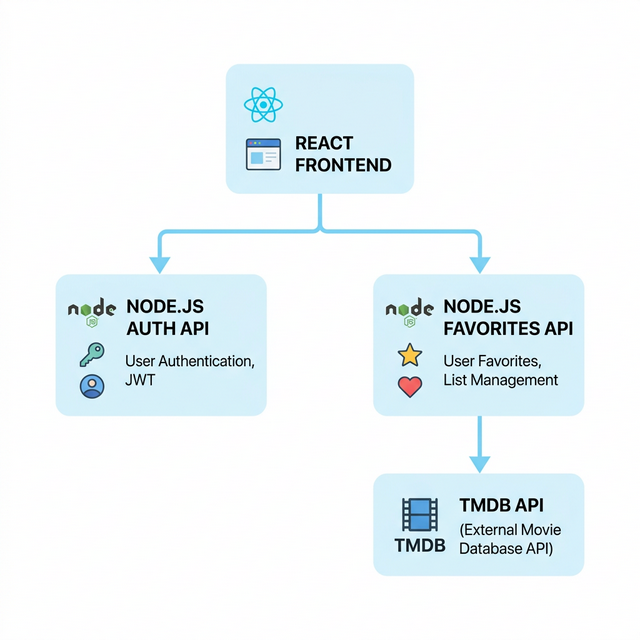
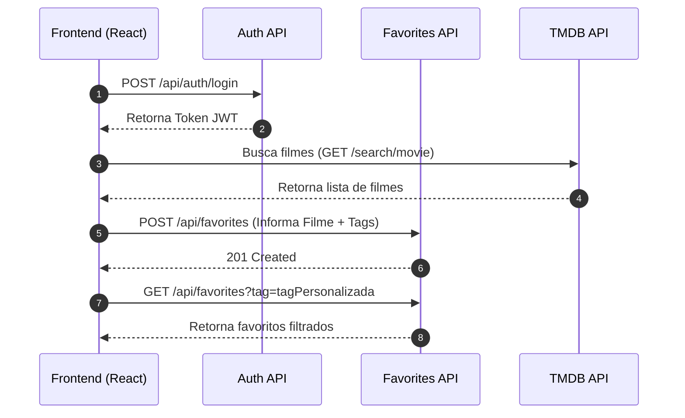
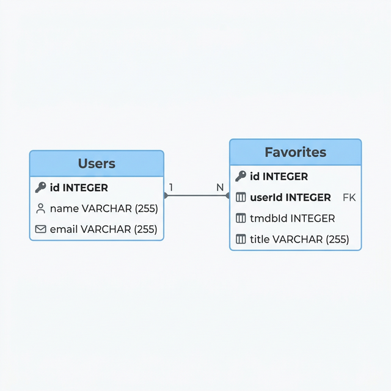
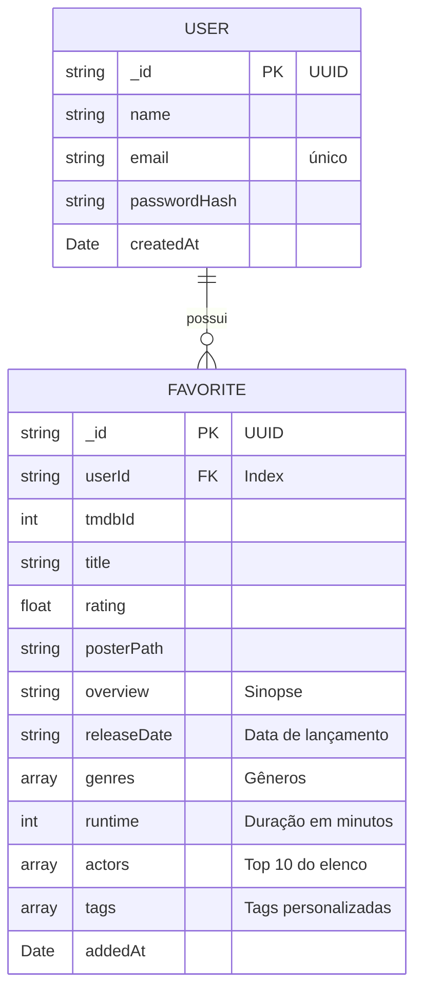
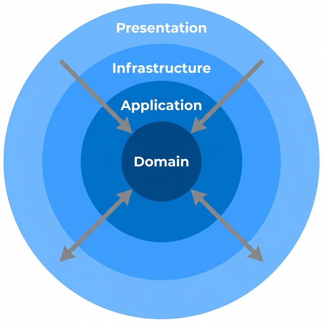
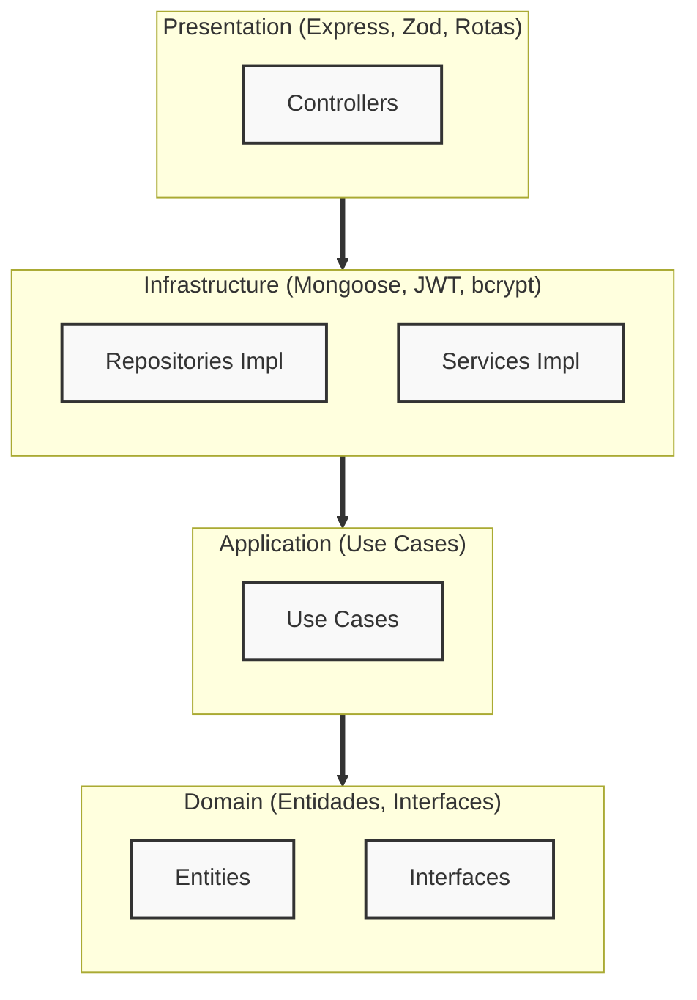
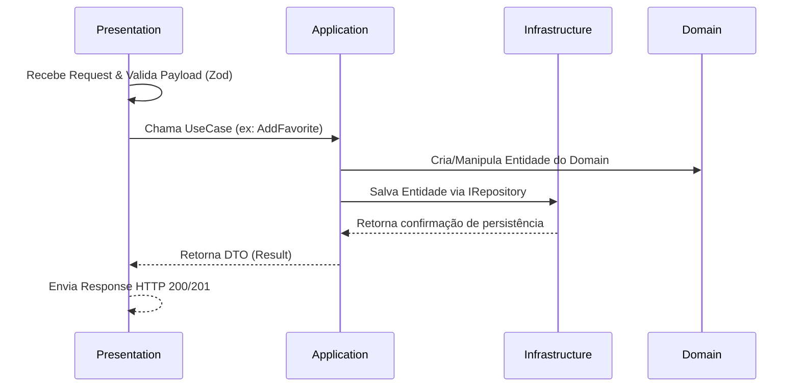
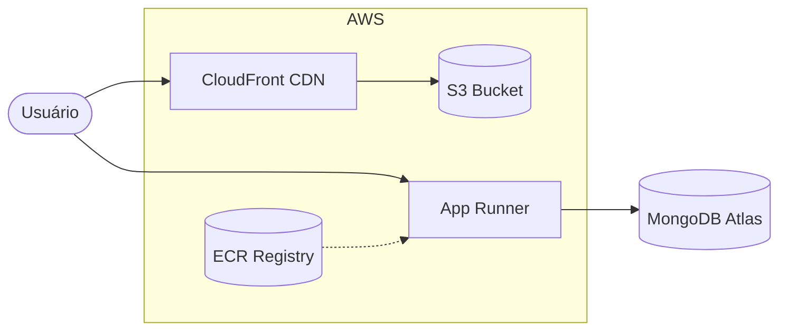

<div align="center">

# CineTag

**Catálogo pessoal de filmes com tags, filtros avançados e paginação.**

Explore filmes via TMDB, salve seus favoritos com tags personalizadas e filtre por ator, gênero, nota e muito mais.


</div>

> **Diagramas Mermaid**: para visualizar os diagramas interativos deste README no VS Code, instale a extensão [Markdown Preview Mermaid Support](https://marketplace.visualstudio.com/items?itemName=bierner.markdown-mermaid). No GitHub, os diagramas já renderizam automaticamente.

---

## Pré-requisitos

- Node.js 19+
- MongoDB rodando localmente ou uma conta no [MongoDB Atlas](https://www.mongodb.com/atlas) (plano M0 gratuito)
- Chave de API do [TMDB](https://www.themoviedb.org/settings/api)

---

## Configuração e execução

### 1. Clone e instale as dependências

```bash
# Backend
cd backend
npm install

# Frontend
cd ../frontend
npm install
```

### 2. Configure as variáveis de ambiente

**Backend** — copie `.env.example` para `.env` e preencha:

```env
PORT=3333
MONGODB_URI=mongodb://localhost:27017/cinetag
JWT_SECRET=sua_chave_secreta_aqui
JWT_EXPIRES_IN=7d
```

**Frontend** — copie `.env.example` para `.env` e preencha:

```env
VITE_API_BASE_URL=http://localhost:3333
VITE_TMDB_API_KEY=sua_chave_tmdb_aqui
VITE_TMDB_BASE_URL=https://api.themoviedb.org/3
VITE_TMDB_IMAGE_BASE_URL=https://image.tmdb.org/t/p/w500
```

### 3. Rode o projeto

```bash
# Backend (porta 3333)
cd backend
npm run dev

# Frontend (porta 5173)
cd frontend
npm run dev
```

### 4. Execute os testes

```bash
# Todos os testes do backend
cd backend
npm test

# Todos os testes do frontend
cd frontend
npm test
```

---

## Fluxo Principal e API

Abaixo está a representação visual arquitetural do fluxo de dados:



Abaixo está o diagrama de sequência do fluxo principal da aplicação abordando as interações de pesquisa e adição de favoritos:



### Endpoints da API

| Método | Rota | Descrição | Autenticação |
|--------|------|-----------|--------------|
| `POST` | `/api/auth/register` | Cadastrar usuário | Não |
| `POST` | `/api/auth/login` | Login | Não |
| `GET` | `/health` | Health check (MongoDB + uptime) | Não |
| `GET` | `/api/favorites` | Listar favoritos com filtros e paginação | Sim |
| `POST` | `/api/favorites` | Adicionar favorito | Sim |
| `PUT` | `/api/favorites/:id/tags` | Atualizar tags de um favorito | Sim |
| `DELETE` | `/api/favorites/:id` | Remover favorito | Sim |

**Query params para `GET /api/favorites`:**

| Param | Tipo | Descrição |
|-------|------|-----------|
| `tag` | `string` | Filtrar por tag exata |
| `actor` | `string` | Filtrar por ator (case-insensitive, busca parcial) |
| `genre` | `string` | Filtrar por gênero do filme |
| `minRating` | `number` | Nota mínima (0–10) |
| `sortBy` | `string` | `rating` ou `addedAt` |
| `order` | `string` | `asc` ou `desc` |
| `page` | `number` | Número da página (default: 1) |
| `limit` | `number` | Itens por página (default: 10, max: 50) |

---

## Arquitetura do banco de dados

O banco possui duas coleções principais: `users` e `favorites`.





**Index composto `{ userId, tmdbId }` com `unique: true`** — impede que o mesmo usuário favorite o mesmo filme duas vezes.

### Como os filtros funcionam

| Filtro | Query MongoDB |
|--------|--------------|
| Por tag | `{ tags: { $in: ["nomeTag"] } }` |
| Por ator | `{ "actors.name": { $regex: "nome", $options: "i" } }` |
| Por gênero | `{ genres: { $in: ["Action"] } }` |
| Nota mínima | `{ rating: { $gte: 7 } }` |
| Ordenação | `.sort({ rating: -1 })` ou `.sort({ addedAt: 1 })` |
| Paginação | `.skip((page-1) * limit).limit(limit)` + `countDocuments` em paralelo |

---

## Arquitetura do backend

O backend segue **Clean Architecture** com quatro camadas cujas dependências fluem exclusivamente para dentro.





### Camadas

| Camada | Responsabilidade |
|--------|------------------|
| **Domain** | Entidades (`User`, `Favorite`), value objects (`Email`, `TmdbId`), interfaces de repositório. Sem dependências externas. |
| **Application** | Use cases que orquestram o domínio. Recebem repositórios e serviços por injeção de dependência. |
| **Infrastructure** | Implementações concretas: Mongoose, bcrypt, JWT. |
| **Presentation** | Controllers Express, rotas, schemas Zod para validação. |

O arquivo `src/container/index.ts` é a **raiz de composição**: único local onde `new` é chamado para instanciar infraestrutura e injetar nas camadas superiores.

### Ciclo de Requisição



---

## Deploy na AWS (Terraform)

A infraestrutura é provisionada como código com **Terraform**, seguindo a arquitetura abaixo:



| Serviço | Recurso | Função |
|---------|---------|--------|
| **S3** | Bucket privado | Armazena o build do frontend |
| **CloudFront** | CDN com OAC | Serve o frontend com HTTPS e cache global |
| **ECR** | Container Registry | Armazena a imagem Docker do backend |
| **App Runner** | Container serverless | Executa o backend com auto-scale e health check |
| **MongoDB Atlas** | Banco de dados | Cluster M0 (free tier) |

### Pré-requisitos

- [AWS CLI](https://aws.amazon.com/cli/) configurado (`aws configure`)
- [Terraform](https://www.terraform.io/downloads) >= 1.0
- [Docker](https://www.docker.com/) para build da imagem

### Passo a passo

```bash
# 1. Configure as variáveis do Terraform
cd infra
cp terraform.tfvars.example terraform.tfvars
# Edite terraform.tfvars com suas credenciais

# 2. Provisione a infraestrutura
terraform init
terraform apply

# 3. Build e push da imagem do backend
ECR_URL=$(terraform output -raw ecr_repository_url)
aws ecr get-login-password --region us-east-1 | docker login --username AWS --password-stdin $ECR_URL
docker build -t cinetag-backend ../backend
docker tag cinetag-backend:latest $ECR_URL:latest
docker push $ECR_URL:latest

# 4. Build do frontend apontando para a API
BACKEND_URL=$(terraform output -raw backend_url)
cd ../frontend
VITE_API_BASE_URL=$BACKEND_URL npm run build

# 5. Upload para o S3
BUCKET=$(cd ../infra && terraform output -raw frontend_bucket)
aws s3 sync dist s3://$BUCKET --delete
```

Ou use o script automatizado: `bash deploy.sh`

### Docker Compose (desenvolvimento local)

```bash
# Sobe backend + frontend com um comando
docker compose up --build
# Backend: http://localhost:3333
# Frontend: http://localhost:80
```
